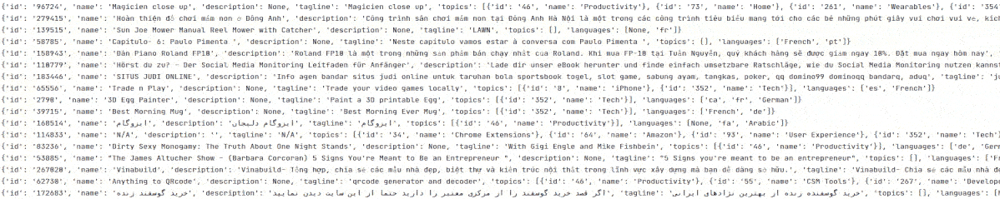
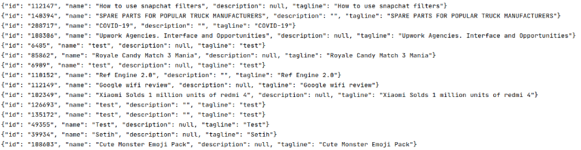

# Product Hunt NLP Experiments
Natural Language Processing (NLP) experiments based on data from Product Hunt.


**Development status**: Data cleaning

## Experiment models

1. A model that suggests topics based on a description of the product (`models/description_to_topics`)
2. A model that describes a product based on given topics (`models/topics_to_description`)
3. A model that generates a tagline based on the product description (`models/description_to_tagline`)
4. A model that names a product based on its description (`models/description_to_name`)
5. A model that comes up with a tagline based on the name of a product (`models/name_to_tagline`)
6. A model that suggests a product name based on a given tagline (`models/tagline_to_name`)

##Dependencies

Install all the required modules:

```bash
pip install -r requirements.txt
``` 


## Data collection

If you prefer to skip this step, there is [a relatively old dataset](https://data.world/producthunt) that 
you can use instead.

Product Hunt offers a [free GraphQL API](https://api.producthunt.com/v2/docs) that has a 
[rate limit](https://api.producthunt.com/v2/docs/rate_limits/headers) based on the complexity and frequency of 
the requests.

For more information, please read their [GraphQL reference](http://api-v2-docs.producthunt.com.s3-website-us-east-1.amazonaws.com/operation/query/).
You can use their [GraphQL explorer](https://ph-graph-api-explorer.herokuapp.com/) to practice.

To get started, create a Product Hunt account and proceed with creating a new application in 
the [API dashboard](https://api.producthunt.com/v2/oauth/applications).

We will be using the developer token via [OAuth Client Only Authentication](https://api.producthunt.com/v2/docs/oauth_client_only_authentication/oauth_token_ask_for_client_level_token). 
Copy `config.conf.example` as `config.conf` and insert your developer token.

At the time of writing, Product Hunt has 206,246 posts and 252 topics.

In order to process tens of thousands of records without occupying too much memory or installing an RDBMS database, we 
need to store records in separate files identified by their unique IDs. This also allows keeping track of previously 
fetched posts and topics.

The `dataset` folder has the following structure:

- `dataset`
  - `posts`
    - `286331.json`
    - `286330.json`
    - `286329.json`
    - `286328.json`
    - ...
  - `topics`
    - `252.json`
    - `251.json`
    - `250.json`
    - `249.json`
    - ...
  - `stats.json`
    
Structure of posts:

```json
{
  "id": "123456",
  "name": "Product name",
  "description": "Product description",
  "tagline": "Product tagline",
  "topics": [
    {
      "id": "1234",
      "name": "Topic name"
    }
  ]
}
```

Structure of topics:

```json
{
  "id": "1234",
  "name": "Topic name"
}
```

Run `dataset/populate.py` to start the data collection process.

This script will attempt to download all posts and topics.

Due to a limitation in their GraphQL API implementation, it's not easy to offset results by a particular post ID. This
means that we have to start from the first post and work our way to the end.

If you hit the API rate limit, the script automatically retries every minute and continues where it left off. It 
keeps track of the last scanned post cursor and ID in `dataset/stats.json`.

## Data cleaning

The raw data contains some anomalies that need to be cleaned out.

Posts that match any of the following criteria need to be deleted:
* Non-English content
  - Using NLP libraries [language-detector](https://github.com/DanielJDufour/language-detector) and 
  [langdetect](https://github.com/Mimino666/langdetect)
  - Description and taglines are used to detect the language
  - If none of the fields are in English, the post is flagged
  - There are false-positives due to low word count
  - About 1.16% of the data (2400 out of 206000 posts) has non-English content
  - 
* Homogeneous data
  - If there is just one unique piece of data among the name, description, and tagline fields
  - About 0.17% of the data (350 out of 206000 posts) is homogeneous
  - 
* Description and tagline only contain links 

Furthermore, there are posts with just enough data to only train a single model.

To know which posts can train which models, we need to group the posts according to these combinations:

* All models
  * Valid name, description, tagline, and topics
* Models 1 and 2 only
  * Valid description and topics
* Model 3
  * Valid description and tagline
* Model 4
  * Valid name and description
* Models 5 and 6 only
  * Valid name and tagline

## About the author

This project was created and is maintained by [Mohammad Tomaraei](https://tomaraei.com).

[](https://tomaraei.com)